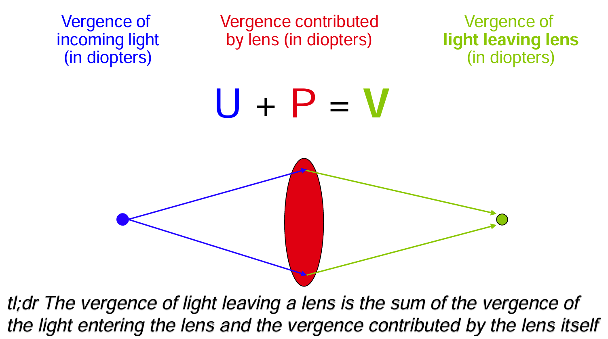

## 目录
- [公式计算理论](#公式计算理论)
- [公式1-Hoffer Q](#公式1 Hoffer Q)
- [公式2-Holladay 1](#公式2 Holladay 1)
- [公式3-SRK/T](#公式3 SRK/T)

---
## 公式计算理论

#### 薄透镜视差理论公式

<u>（概括且通俗理解：极简化光学原件及路径以计算）</u>

薄透镜：极简眼球模型，把 IOL 当成一片“没有厚度的镜片”

视差Vergence：
- **视**：“看、成像、视觉”
- **差**：不是位置差，而是“**状态差 / 趋势差**”
  「个人理解"差"为：光线路径的变化程度」

视差是用一个量来描述光线当前的「聚散趋势」
- **视差为 0**：光线处于平行状态，尚未表现出向某一成像点会聚的趋势。
- **视差为正值**：光线已呈现会聚趋势，若保持当前状态，将在前方某一位置汇聚成像。
- **视差数值越大**：光线的会聚程度越高，预期的汇聚位置距离当前位置越近。

#### 视差法在 IOL 计算中的应用逻辑

1. 设定入射光的初始视差（如远距离目标对应平行光，视差为 0 D）；
2. 光线经角膜折射后视差变化；
3. 光线传播至 IOL 等效位置（ELP）；
4. IOL 折射后视差变化；
5. 光线传播传播至视网膜平面；
6. 反向求解 IOL 屈光力
   通过设定最终视差满足成像条件（即光线恰好在视网膜平面聚焦），反向求解所需的人工晶状体屈光力

在整个过程中，**视差作为描述光线聚散趋势的状态量**，使得光线的传播与折射可以在统一的数学框架下逐步处理，从而避免直接处理复杂的光线几何路径。

> [!note]
> 既然都是用理论光学推导，那么：
> 薄透镜视差理论公式(第三代)和传统理论公式有什么区别？
> 
> 以下划重点：
> 传统：计算时 IOL 位置通常设为固定值或极简经验值
> 薄透镜视差理论公式：明确提出并引入 ELP（有效晶体位置），并作为重要的可变预测量（通过可测得参数计算预测ELP）
> 
> 👉🏻第三代公式之间的差别，主要在于它们对ELP的预测方法不同。

---
## 公式1 Hoffer Q

##### 核心思想：ELP 主要由眼轴决定

> **将 ELP 主要视为眼轴长度（AL）的函数。**

基于临床观察认为：
- **短眼**：IOL 实际位置更偏前
- **长眼**：IOL 实际位置更偏后

在计算中：
- **AL 是 ELP 预测的核心变量**
- 角膜曲率等因素仅作次要修正

**优势**
- 在 **短眼（尤其 AL < 22 mm）** 中精度较好

**局限**
- 对前节结构（ACD、LT、WTW）利用有限
- 在极长眼轴中通常不如 SRK/T 或更新公式
- 不适用于屈光手术后角膜

---
## 公式2 Holladay 1
##### 核心思想：Surgeon Factor（手术者因子）

> Holladay 1 的最大特点是引入了 **Surgeon Factor（SF）**

什么是 Surgeon Factor？
- 表示**某一手术者在其常规手术条件下，IOL平均的术后位置**
- 本质上是对 **ELP 的个体化校准**

在计算中：
- **ELP = Surgeon Factor 为基础**
- 再根据：眼轴长度（AL）、角膜曲率（K）进行修正

**优势**
- 对单一术者而言，**重复性好、稳定性高**
- 便于进行个体化常数优化
- 在常规眼轴范围内表现可靠

**局限**
- 对前节结构参数利用有限
- 跨医生、跨中心的可比性相对较弱
- 在极端眼轴或复杂眼中准确度不佳

---
## 公式3 SRK/T

> SRK/T = SRK（回归经验） + T（理论，Theoretical）

在计算中：**ELP 并非由单一因素决定**，而是：
- 以 **眼轴长度（AL）** 为主要依据
- 同时考虑 **角膜曲率（K）** 的影响
- 在理论模型基础上，引入**经验性回归**修正

**优势**
- 在 **长眼轴**中表现稳定

**局限**
- 对前节结构（ACD、LT、WTW）利用有限
- 在短眼中通常不如 Hoffer Q
- 在复杂眼中准确度不佳

---
