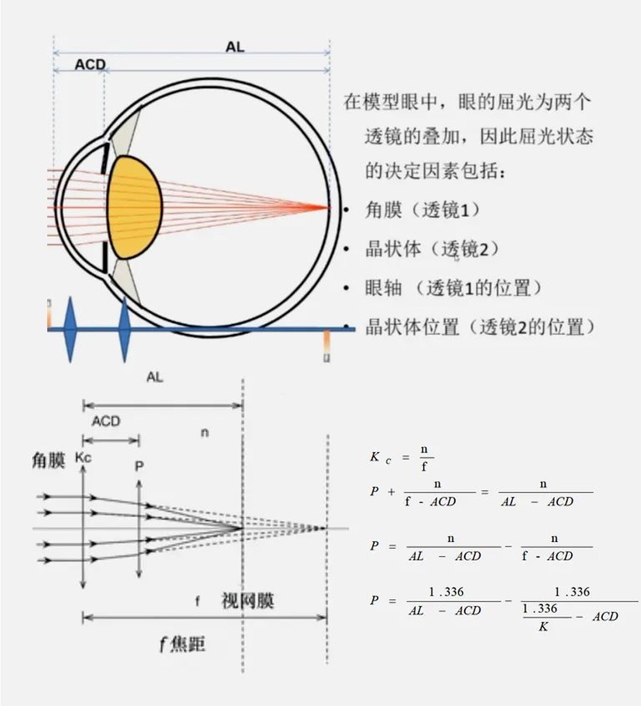

## 目录
- [第一阶段：传统理论公式](#第一阶段：传统理论公式)
- [第二阶段：回归公式](#第二阶段：回归公式)
- [第三阶段：薄透镜视差理论公式](#第三阶段薄透镜视差理论公式)
- [第四阶段：厚透镜多变量理论公式](#第四阶段：厚透镜多变量理论公式)
- [第五阶段：人工智能与光线追迹公式](#第五阶段：人工智能与光线追迹公式)

*本文简要介绍了IOL计算的发展过程，并在相应位置附上了便于理解的延伸内容链接。

---
## 第一阶段：传统理论公式

1970s
### 背景
- 人工晶状体刚进入临床
- 生物测量手段有限（早期 A-scan、角膜曲率计）
- 研究者尝试用**几何光学与近轴理论**直接推导 IOL 度数
### 特征
- 基于**光学理论推导**
- IOL 被视为**薄透镜**
- 术后 IOL 位置通常假设为**固定或高度简化**
### 代表公式
- Binkhorst formula
- Gills formula
- Clayman formula
- Fyodorov formula

---
## 第二阶段：回归公式

1970s–1980s
### 背景
- 理论公式在临床中误差较大
- 超声测量普及，术后数据快速积累
- 临床转而依赖**统计回归方法**
### 核心特征
- 不建立明确的眼光学模型
- 通过回归公式计算
- 依赖A常数（A-constant）
### 代表公式
- **SRK I**（1979）： 公式：P = A-2.5（L）-0.9（K）
- **SRK II**（1988）：公式：P = A-2.5（L）-0.9（K）(根据眼轴校正A常数)
	- L=眼轴长度 K=角膜曲率

---
## 第三阶段：薄透镜视差理论公式

1990s
### 背景
- 前阶段公式计算误差较大
- 重新引入**近轴光学与视差理论**
### 核心特征
- 提出 <mark style="background:#fff88f">有效人工晶状体位置（ELP）</mark> 概念
- IOL 仍视为薄透镜
- ELP 通过理论或经验方法预测

### 代表公式
- **Hoffer Q**（1993）
- **Holladay 1**（1993）
- **SRK/T**（1994）

👉🏻点击查看[第三阶段：薄透镜视差理论公式]详细介绍（一看就懂）

---
## 第四阶段：厚透镜 / 多变量理论公式

2000s–2010s
### 背景
- 生物测量技术成熟
- 认识到 **ELP 预测是屈光误差的核心**
### 核心特征
- IOL 被视为**厚透镜（具有前后主平面）**
- 构建更真实的前节几何模型
- 同时引入多项参数（AL、K、ACD、LT、WTW 等）
### 代表公式
- **Haigis**（2000）
- **Holladay 2**（2003）
- **Olsen**（2007）

👉🏻点击查看[第四阶段：厚透镜多变量理论公式]详细介绍（一看就懂）

---
## 第五阶段：人工智能与光线追迹公式

2010s–至今
### 背景
- 大数据与机器学习进入眼科
- SS-OCT、Scheimpflug 等成像技术成熟
- 屈光手术后白内障病例显著增加
### 核心特征
- **人工智能公式**
	- 数据驱动， ELP建模
	- 对极端眼轴更准确
- **光线追迹公式**
	- 不依赖近轴假设
	- 基于 Snell 定律构建个体化眼模型
### 代表公式
- **Hill-RBF**（2015）
- **Kane**（2017）
- **PEARL-DGS**（2019）
- **OKULIX（ray tracing）**（约 2009）
- **SS-OCT–based ray tracing formulas**（2020s）

👉🏻点击查看[第五阶段：人工智能与光线追迹公式]详细介绍（一看就懂）

---

